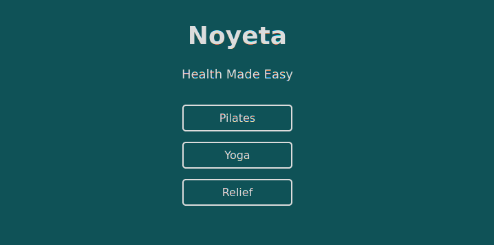
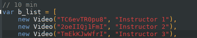

# Noyeta

Find Pilates/Yoga/Relief videos on YouTube distraction-free with variety.

Website: www.noyeta.com

## Ways to Contribute
* Add a pilates/yoga/relief video that you like
* Improve design  

If you have any questions about anything, you can reach out to me at [dev@noyeta.com](mailto:dev@noyeta.com).

## How are Videos Picked?

I store the YouTube video IDs in the directory sites/static/js/. The list files are: 
* pilates_list.js 
* yoga_list.js 
* relief_list.js 

The format of each entry is:
~~~
new Video("YOUTUBE_URL_VIDEO_ID", "INSTRUCTOR_CHANNEL_NAME"),
~~~

When you click an exercise category, and then the length of target area, it randomly picks a URL from the correct list.

## How to get Video ID?
For the below url:
~~~
www.youtube.com/watch?v=Xxy_Dx1log8
~~~

The Video ID would be:
~~~
Xxy_Dx1log8
~~~

